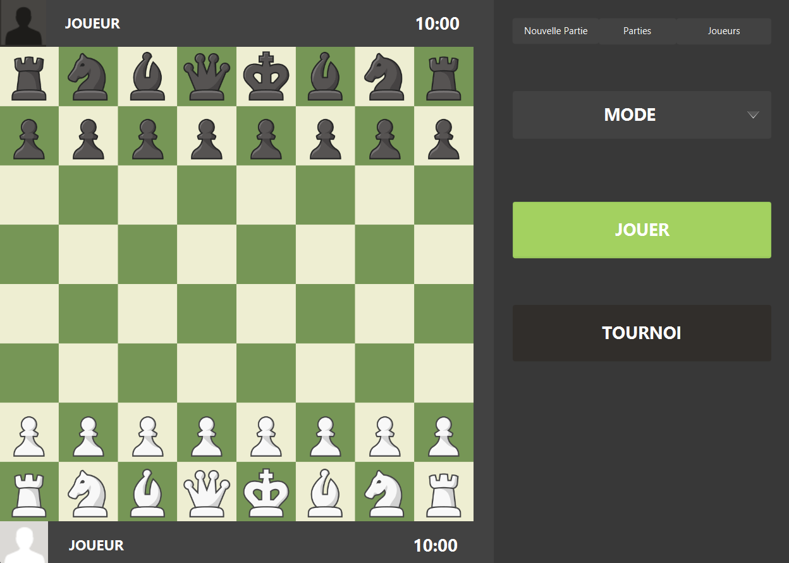
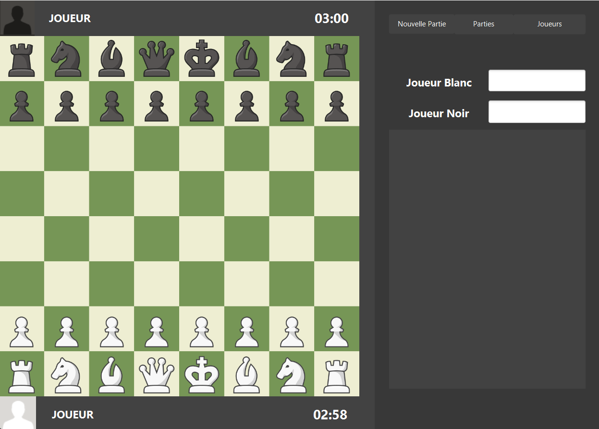
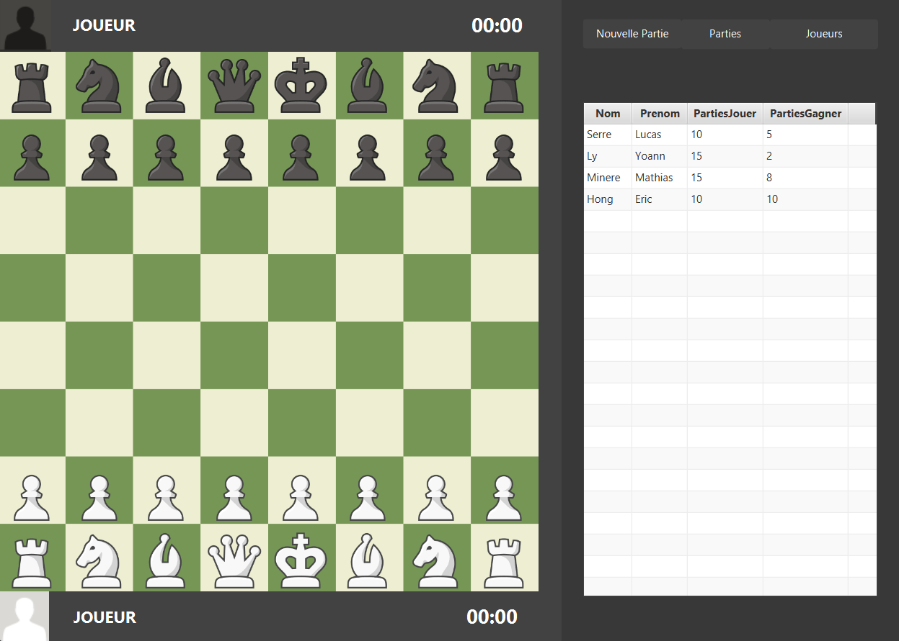
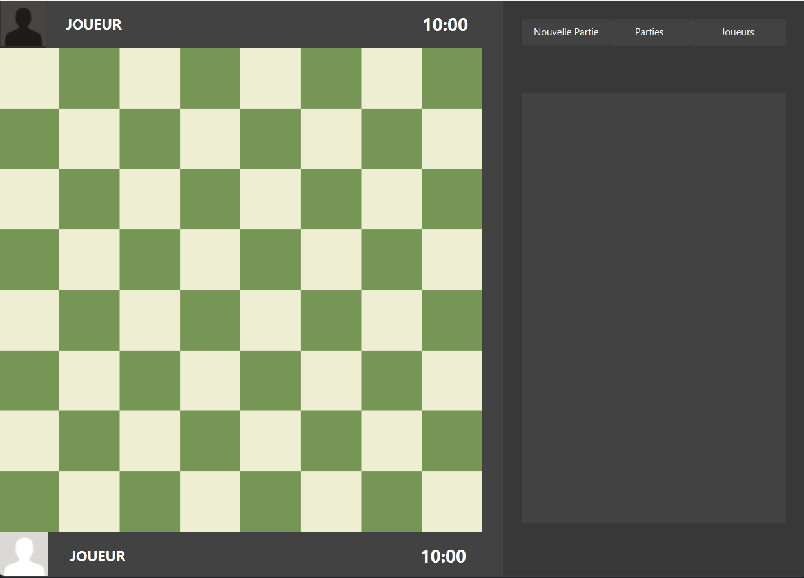

# Jeu d'Échecs

Bienvenue dans notre implémentation d'un jeu d'échecs ! Ce projet est un jeu d'échecs classique, développé dans le cadre d'un projet en SAE, permettant aux utilisateurs de jouer des parties d'échecs en mode joueur contre joueur.

## Fonctionnalités

- **Interface utilisateur** : Une interface simple et propre, inspirée du site en ligne Chess.com.
- **Joueur contre Joueur** : Jouez contre un autre joueur sur le même appareil.
- **Déplacement des pièces** : Déplacez les pièces en suivant les carrés jaunes.
- **Mouvements spéciaux** : (Non implémenté)
- **Mise en échec et échec et mat** : (Non implémenté)
- **Systeme de Sauvegarde de Parties/Replay** : (Non implémenté)

## Pré-requis

Pour exécuter ce projet, vous aurez besoin des éléments suivants :

- Un IDE permettant d'exécuter des projets en JavaFX.
- De cloner ou télécharger tous les fichiers/documents du projet.

## Instructions d'installation et d'exécution

1. Clonez ou téléchargez le projet à partir du dépôt.
   ```bash
   git clone <URL_du_dépôt>
2. Executer le Fichier ChessMain via l'IDE


## Mode d'emploie
### Page d'aceuil
- **Button Jouer** : Lancement de la Partie
- **Mode** : Choix du mode
- **Button Joueurs** : Affiche la liste de Joueur
- **Button Parties** : Affiche L'historique des Parties (non implémenté)
- **Button Nouvelle Partie** : Retour a la Page de Base

### Page InGame
- **TextField** : Definit les Joueurs

### Page Joueurs

### Page Parties
- **Non implémenté**


## Auteur

- **Hong Eric**
- **Ly Yoann**
- **Miniere Mathias**
- **Serre Lucas**
